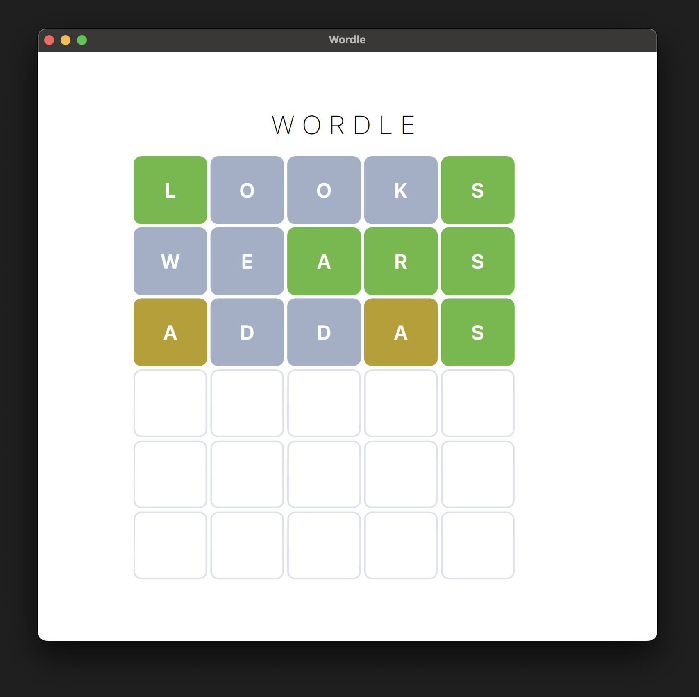

# Sudoku Game

This is a Wordle game implemented in C++ and QML using the Qt framework.

    

## Getting Started

These instructions will get you a copy of the project up and running on your local machine for development and testing purposes.

### Prerequisites

- C++ Compiler
- Qt Framework (Compatible with Qt 5.14 and above, tested with Qt 6.x)
- Cmake (or qmake)